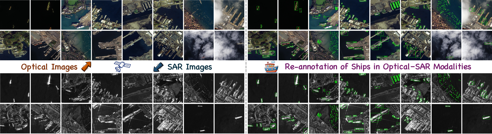
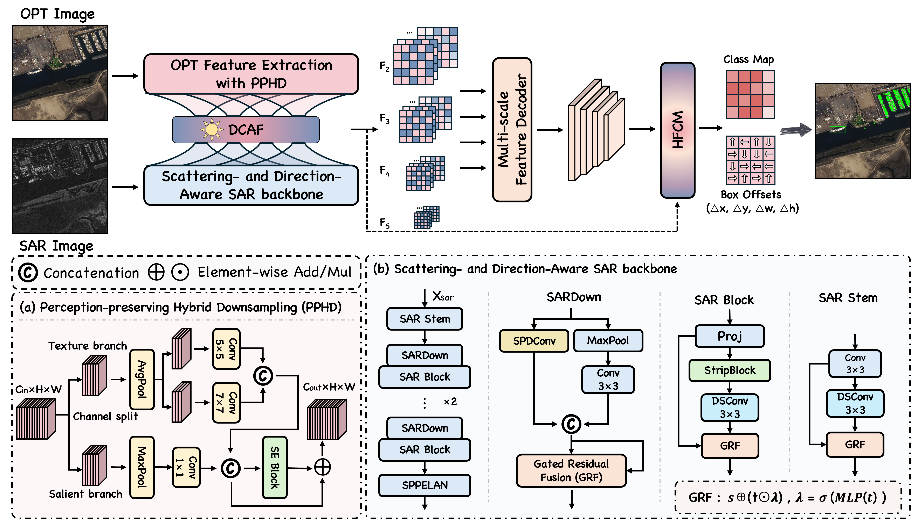

# HMA-Det: Heterogeneous Modality-Aware Optical-SAR Detection Framework for Remote Sensing Ship Detection


### [**📝Paper**]() | [**🗃️Dataset**]()

The official repository for the re-annotated datasets and HMA-Det.

## Abstract

> OPT-SAR ship detection is a challenging problem due to modality heterogeneity between optical and SAR imagery. Existing multimodal detectors typically rely on shared backbones or simple fusion strategies such as concatenation or element-wise addition, which fail to effectively handle modality discrepancies and often result in suboptimal feature integration. To address this issue, we propose HMA-Det, a heterogeneous modality-aware detection framework that explicitly models modality heterogeneity for robust OPT-SAR ship detection. Specifically, we design a Heterogeneous Modality-Aware Backbone (HMAB) to separately encode optical and SAR features, preserving modality-specific representations. A Difference-guided Cross-modal Attention Fusion (DCAF) module is introduced to explicitly model inter-modal discrepancies and perform adaptive feature calibration for more reliable cross-modal interaction. Furthermore, a Hierarchical Feature Compensation Module (HFCM) is developed to recover fine-grained spatial details lost during multi-scale feature aggregation, improving localization accuracy for small and weak ship targets. In addition, we construct and refine two OPT-SAR ship detection benchmarks, MOS-Ship and QXS-Ship, to provide a unified evaluation setting. Extensive experiments demonstrate that the proposed method outperforms state-of-the-art detectors across benchmarks and metrics, validating the effectiveness of explicitly modeling modality heterogeneity in OPT-SAR fusion.

## The re-annotated MOS-Ship Dataset

The MOS-Ship dataset is publicly available on [Google Drive](). \
The dataset structure is as follows::

```
data
├── MOS-Ship
│   ├── images
│		├── train
│			├── xxx.png
│			├── xxx.png
│		├── val
│   ├── labels
│		├── train
│			├── xxx.txt
│			├── xxx.txt
│		├── val
│   ├── sarimages
│   └── labels-sar

```



## Pipeline



## Requirements

### Installation

```bash
conda create -n hma python=3.8
```

```bash
conda activate hma
```

```bash
pip install -r requirements.txt
```

## Training
```bash
python train.py --data MOS-Ship.yaml --epochs 100 --batch 16
```

## Testing
```bash
python val.py --weights best.pt --data MOS-Ship.yaml
```

